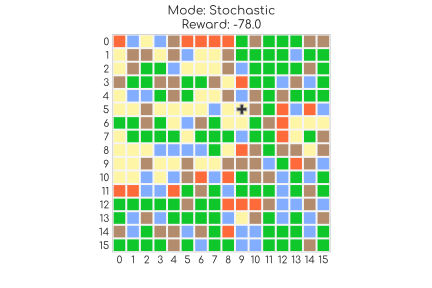

# Gym Forest Fire
Forest Fire Environment Maker for OpenAI Gym.<br>
*gym_forest_fire*<br>
*version 2.4*



## Installation
1. Install [OpenAi Gym](https://github.com/openai/gym)
```bash
pip install gym
```

2. Download and install `gym-forest-fire`
```bash
git clone https://github.com/elbecerrasoto/gym-forest-fire
cd gym-forest-fire
pip install -e .
```

3. Import and have fun
```python
import gym_forest_fire
from gym_forest_fire import EnvMakerForestFire, ForestFire
```

## Basic Info

The package implements a tool for making environments<br>
for Reinforcement Learning tasks.

It also contains a preloaded environment and a forest fire cellular automaton simulator.

The created environments follow the guidelines of the Open AI gym API,
and would contain the following methods:

``` python
from gym_forest_fire import EnvMakerForestFire
env = EnvMakerForestFire()   
    
env.reset()
action = 7
env.step(action)
env.render()
env.close()
```

The created environment simulates a helicopter trying to extinguish a forest fire.

The forest is simulated using a Forest Fire Automaton [Drossel and Schwabl (1992)] and<br>
the helicopter as a position on top of the lattice and some effect over the cells.

At each time step the Agent has to make a decision to where in the neighborhood to move the helicopter,<br>
then the helicopter moves and has some influence over the destination cell,<br>
the effect is simply changing it to another cell type, usually from 'fire' to 'empty'<br>
and the reward is some function of the current state of the system,<br>
usually just counting cells types, multiplying for some weights (positive for trees and negative for fires) and adding up.

### Cellular Automaton Rules
**Forest Fire Automaton Drossel and Schwabl (1992)**

Three type of cells: TREE, EMPTY and FIRE.<br>
At each time step and for each cell apply the following rules
(order does not matter).
1. **Lighting Rule**<br>
With probability f:<br>
TREE turns into Fire
2. **Propagation Rule**<br>
If at least one neighbor is FIRE:<br>
TREE turns into Fire
3. **Burning Rule**<br>
Unconditional:<br>
FIRE turns into EMPTY
4. **Growth Rule**<br>
With probability p:<br>EMPTY turns into TREE                    

Also two more cells were added.
* ROCK, does not interacts with anything
    Used as a true death cell
    Used on the Deterministic mode
    Used on the invariant boundary conditions
* LAKE, does not interacts with anything
    Used on other classes that inherit from ForestFire

**Deterministic mode:**
The automaton does not computes
the Lighting and Growth rules, stops when there are
no more FIRE cells.

For an overview of all the capabilities of **EnvMakerForestFire**
check the documentation.
```python
help(EnvMakerForestFire)
```

The package also contains an already instantiated example of an environment, described below.

## Preloaded Implementation
The _ForestFire-v0_ environment implements a
[forest fire cellular automaton](https://en.wikipedia.org/wiki/Forest-fire_model)
of 16x16 cells, with parameters _f=0.005_ and _p=0.100_

The control task is to move a helicopter through the lattice,
to try to extinguish the fire. The helicopter
has the effect of turning fire cells to empty cells whenever on top of them.

The possible actions to take are 9, either moving one-step into 8 directions,
or staying at the same place.

Each number from 1 to 9 represents one direction.

1. Left-Up
2. Up
3. Right-Up
4. Right
5. Don't move
6. Left
7. Left-Down
8. Down
9. Right-Down

The helicopter can move 8 times before the next computation
of the forest fire automaton. Basically, the helicopter can
travel half the distance of the forest before the next actualization.
This roughly represents the helicopter's speed.

The reward scheme is -1 per burning tree at each time.

The task is continuing.

The representation of the lattice is
a numpy matrix.

* 0.77 represents a tree
* 0.66 represents empty
* -1.0 represents fire

The observation returned by the the step method is a tuple of three elements,
the first is the lattice the second element is the postion of the helicopter in a [row, col] format,
and the third the remaining moves of the helicopter to update the cellular automaton. 

The starting position of the helicopter is 8,8, just in the middle.
The starting forest configuration is random,
with 0.75 chance of a tree and 0.15 of an empty space.

The cell numeration starts from the left and upper corner. So the cell at 0,0
is at the most left and upper postion and the cell at 15,15 is at most right and down postion.

## Running
Start by importing the package and initializing the environment
```python
import gym
import gym_forest_fire
env = gym.make('ForestFire-v0')
```

## Random Policy
Implementing the random policy
```python
import numpy as np
import gym
help(EnvMakerForestFire)
env = gym.make('ForestFire-v0')

# First observation
obs = env.reset()
env.render()

total_reward = 0
for i in range(128):
  print('.', end='')
  action = env.random_policy()
  obs, reward, done, info = env.step(action)
  total_reward += reward
  env.render()

print('\nTotal Reward: {}'.format(total_reward))
```

## Custom Grid
```python
import gym_forest_fire
import numpy as np

symbols = {'tree':0.77, 'empty':0.66, 'fire':-1.0, 'rock':0.88, 'lake':0.99}

rows = 7
cols = 7
r_mid = int(rows/2)
c_mid = int(cols/2)

# All rocks grid
grid = np.repeat(symbols['rock'],rows*cols).reshape(rows, cols)
grid[r_mid,:] = symbols['tree']
grid[:, c_mid] = symbols['tree']
grid[0,:] = symbols['tree']
grid[r_mid, c_mid] = symbols['rock']
grid[2, c_mid-1] = symbols['tree']
grid[2, c_mid] = symbols['rock']

env = EnvMakerForestFire(init_pos_row=r_mid, init_pos_col=c_mid, custom_grid=grid,
                                    p_fire=0.01, p_tree=0.75,
                                    sub_tree='empty',
                                    moves_before_updating=2,
                                    reward_tree=3.0, reward_fire=-1.0,
                                    **symbols)
env.reset()
env.render()
```

